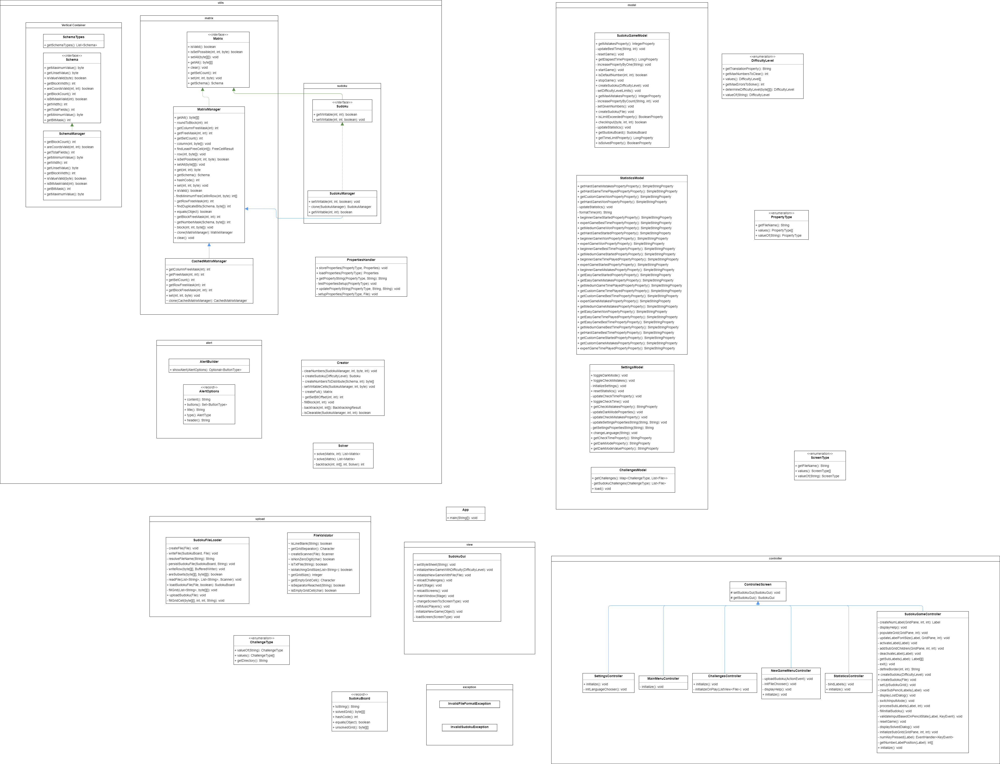

# Design

## MVC

- Our application has for every `ScreenType` its own `FXML` file. This was created using Scene Builder.
- All these screens have their own `Controller` and `Model`.
- Every screen is defined in the enum `ScreenType`. This allows for a central place where all the links to the `FXML`
  files are located.
- Each `Controller` extends from the abstract superclass `ControlledScreen` to automatically give access to
  the `SudokuGui` so the `Controllers` can forward actions after an event accordingly.
- The `Controller` defines on each `FXML` element the appropriate action.
- `Models` are used to contain the data being displayed e.g. `ChallengesModel` or `SudokuGameModel`

## Sudoku Generator & Solver

- `SudokuSolver`:
    - Implements the logic to solve a given Sudoku.
    - Uses a recursive backtracking algorithm to solve the puzzle.
    - Includes methods to check if a number can be placed in a particular cell.
- `SudokuGenerator`:
    - Implements the logic to generate a new Sudoku.
    - Uses a recursive algorithm to fill the puzzle with numbers.
    - Includes methods to print the generated puzzle and to remove cells to create a new puzzle with a specified
      `DifficultyLevel`.
- It contains three interfaces to allow for flexible generation and solving:
    - `Matrix`: Acts as a generic interface which can also deal with non-Sudoku like grids. It offers methods to set and
      get cells and also validates it.
    - `Sudoku`: Extends the `Matrix` interface which is used by the `SudokuManager` to create and solve a 9x9 grid.
    - `Schema`: Interface to have different `SchemaTypes`, in our case we only have a 9x9 grid for now.

## Logging & Exception-Handling

- For any kind of exception e.g. invalid file for upload provided or if a Sudoku could not be loaded, we display alert
  windows.
- The util class `AlertBuilder` class is responsible for creating these in a unifying way.
- Logging was implemented to have information available when something went wrong.

## Properties

- This application uses property files to provide a better user experience by being able to customize the game and have
  this customization reloaded upon start of the application.
- It is divided into two separate files:
    - Settings: Used to store all the settings such as selected language and if dark mode is enabled or not.
    - Statistics: Used to store the statistics, so they can be displayed at any time.
- To access properties in an easy way, the static class `PropertiesHandler` was created to have a central place for
  that.

## Multi-Language

- To support multiple languages, we implemented `MessageBundles` properties.
- There is one for the default, one for English and one for German.
- It can be extended anytime very easily just by adding a new `MessageBundle` property file for the new message and
  provide a translation for every label.
- The property files contain labels which are being referred two in two different ways:
    - From `FXML` files using `text="%label"`
    - From the code directly using `String.format(resourceBundle.getString("label"), Object... args))`. This for example
      allows for localized exception messages.

## Sudoku Upload

- The upload mechanism was implemented in a generic way to allow for different types in the future:
    - The `FileValidator` can expect any grid size, file separator and empty grid cell
    - That way it is flexible and reusable in case a new type of Sudoku grid game needs to be parsed
- A user only has to provide the unsolved grid of the Sudoku. It then parses the Sudoku and uses the Solver to determine
  if the Sudoku has one unique solution. It also determines the `DifficultyLevel` which specifies how many numbers needs
  to be cleared maximum, how many mistakes can be made and the timer.
- Once validated, it saves both the unsolved and solved grid as a `SudokuBoard` object in a new file. This allows for
  direct loading in the Challenges section, as we do not need to check again if it is solvable with one unique solution.
- To prevent having the same Sudoku name + grids saved multiple times, it calculates the hashcode of the `SudokuBoard`
  to check if the exact same grids with the same name has been uploaded already.

## Challenges

- There are two different type of Challenges which are displayed using a `ListView`:
    - Pre-generated:
    - User-generated:
- The enum `ChallengeType` contains the location where these are stored in.
- To have a specific display for each challenge entry and not just have the `toString()` from the `File` class called, a
  `FileCellFactory` was implemented to override what should be displayed.

# Class diagram

